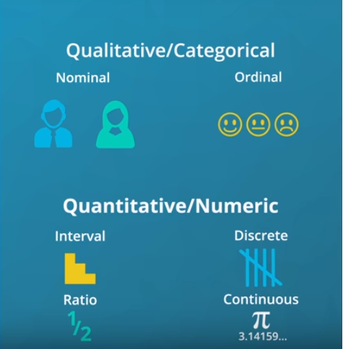

# Visualization

### - There are two main reasons for creating visuals using data:

  - **Exploratory analysis** is done when you are searching for insights. These visualizations don't need to be perfect. You are using plots to find insights, but they don't need to be aesthetically appealing. You are the consumer of these plots, and you need to be able to find the answer to your questions from these plots.


  - **Explanatory analysis** is done when you are providing your results for others. These visualizations need to provide you the emphasis necessary to convey your message. They should be accurate, insightful, and visually appealing.

### -The five steps of the data analysis process:
  1. Extract - Obtain the data from a spreadsheet, SQL, the web, etc.
  2. Clean - Here we could use exploratory visuals.
  3. Explore - Here we use exploratory visuals.
  4. Analyze - Here we might use either exploratory or explanatory visuals.
  5. Share - Here is where explanatory visuals live.
  
 ### - **Python Data Visualization Libraries** 
  1. **[Matplotlib](https://matplotlib.org/)**: a versatile library for visualizations, but it can take some code effort to put together common visualizations.
  2. **[Seaborn](https://seaborn.pydata.org/)**: built on top of matplotlib, adds a number of functions to make common statistical visualizations easier to generate.
  3. **[pandas](https://pandas.pydata.org/)**: while this library includes some convenient methods for visualizing data that hook into matplotlib, we'll mainly be using it for its main purpose as a general tool for working with data.
  All together, these libraries will allow you to visualize data in a balance of productivity and flexibility, for both exploratory as well as explanatory analyses.

# Design of Visualizations
The important aspects regarding the design of visualizations:

## The Four Levels of Measurement
In order to choose an appropriate plot type or method of analysis for your data, you need to understand the types of data you have. One common method divides the data into four levels of measurement:

- **Qualitative or categorical types** (non-numeric types)
 1. **Nominal data**: pure labels without inherent order (no label is intrinsically greater or less than any other), Ex. movie Genre "Action, Comedy,.." or countries "Chine, USA, Germany.."
 2. **Ordinal data**: labels with an intrinsic order or ranking (comparison operations can be made between values, but the magnitude of differences are not be well-defined) Ex. Letter Grades: A > B > C OR Ranking 1<sup>st</sup> > 2<sup>nd</sup>  > 3<sup>rd</sup> 
- **Quantitative or numeric types**
Quantitative data take numerical values that allow for mathmetical operations
 3. **Interval data**: numeric values where absolute differences are meaningful (addition and subtraction operations can be made) Ex, Years or Tempreature
 4. **Ratio data**: numeric values where relative differences are meaningful (multiplication and division operations can be made)</br>
 
 

 - All quantitative-type variables also come in one of two varieties: **discrete** and **continuous**.
    - **Discrete** quantitative variables can only take on a specific set values at some maximum level of precision.
    - **Continuous** quantitative variables can (hypothetically) take on values to any level of precision.
  
Distinguishing between continuous and discrete can be a little tricky – a rule of thumb is if there are few levels, and values can't be subdivided into further units, then it's discrete. Otherwise, it's continuous. If you have a scale that can only take natural number values between 1 and 5, that's discrete. A quantity that can be measured to two digits, e.g. 2.72, is best characterized as continuous, since we might hypothetically be able to measure to even more digits, e.g. 2.718. A tricky case like test scores measured between 0 and 100 can only be divided down to single integers, making it initially seem discrete. But since there are so many values, such a feature is usually considered as continuous.</br>


```
When exploring your data, the most important thing to consider first is 
whether your data is qualitative or quantitative, discrete or continuous.

```

## Visual Encodings
Experts and researchers have determined the types of visual patterns that allow humans to best understand certain information. In general, humans are able to best understand data encoded with **positional changes** (differences in x- and y- position) and **length changes** (differences in box heights). </br>

Alternatively, humans struggle with understanding data encoded with **color hue changes** and **area changes**</br>

**Chart junk** refers to all visual elements in charts and graphs that are not necessary to comprehend the information represented on the graph or that distract the viewer from this information.

- Examples of chart junk you saw in this video include:
  - Heavy grid lines
  - Unnecessary text
  - Pictures surrounding the visual
  - Shading or 3d components
  - Ornamented chart axes

The **data-ink ratio**, credited to Edward Tufte, is directly related to the idea of chart junk. The more of the ink in your visual that is related to conveying the message in the data, the better.

```
Limiting chart junk increases the data-ink ratio.
```

## Design Integrity


Lessons 3-5: Exploration of Data
These lessons systematically present core visualizations in exploratory data analysis. Exploration starts with univariate visualizations to identify trends in distribution and outliers in single variables. Bivariate visualizations follow, to show relationships between variables in the data. Finally, multivariate visualization techniques are presented to identify complex relationships between three or more variables at the same time.

Lesson 6: Explanatory Visualizations
This lesson describes considerations that should be made when moving from exploratory data analysis to explanatory analysis. When polishing visualizations to present to others, you will need to consider what findings you want to focus on and how to use visualization techniques to highlight your main story. This lesson also provides tips for presentation of results and how to iterate on your presentations.

Lesson 7: Visualization Case Study
In this lesson, you will bring together everything from the previous lessons in an example case study. You will be presented with a dataset and perform an exploratory analysis. You will then take findings from that analysis and polish them up for presentation as explanatory visualizations.
